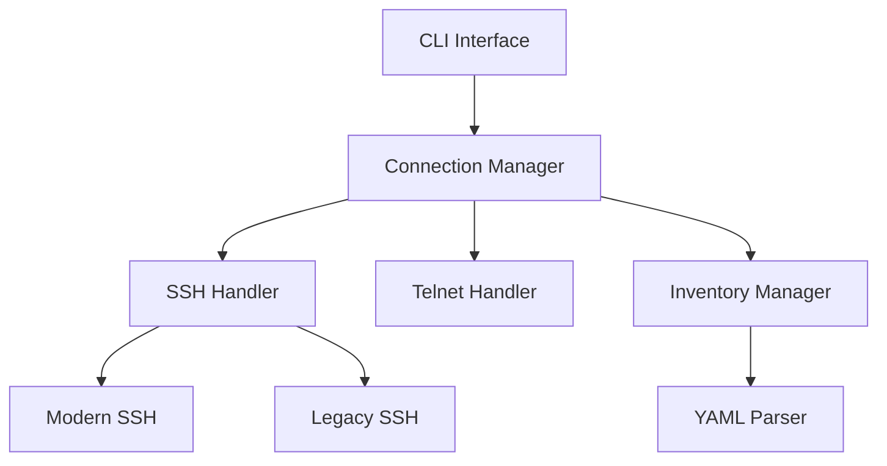

# Design Document: Terminal Connection Manager (jess)

## Overview

The Terminal Connection Manager (jess) is a Python-based CLI tool designed to simplify and streamline connections to network devices via SSH and Telnet protocols. It provides intelligent fallback mechanisms to handle various device compatibility scenarios and offers clear visual feedback through colored console output. The tool uses a YAML-based inventory system to store and manage device connection information.

## Architecture

### High-Level Architecture

The application follows a modular architecture with clear separation of concerns:



### Core Components

1. **CLI Interface**: Handles user input, command parsing, and output formatting
2. **Connection Manager**: Orchestrates connection attempts and fallback logic
3. **Protocol Handlers**: Specialized modules for SSH and Telnet connections
4. **Inventory Manager**: Manages device information storage and retrieval
5. **YAML Parser**: Handles configuration file reading and writing

## Components and Interfaces

### CLI Interface

The CLI interface will be implemented using Python's `argparse` library to handle command-line arguments and options.

```python
# Command structure
jess <hostname>      # Connect to a device
jess edit            # Edit inventory file
jess load <filename> # Load inventory from file
jess show            # Display inventory in a formatted table
```

### Connection Manager

The Connection Manager serves as the core orchestration component, managing the connection workflow and fallback mechanisms.

```python
class ConnectionManager:
    def connect(self, hostname):
        # 1. Look up device in inventory
        # 2. Try connection methods in order (SSH modern → SSH legacy → Telnet)
        # 3. Handle success/failure with appropriate messaging
```

### SSH Handler

Handles both modern and legacy SSH connections with appropriate security settings.

```python
class SSHHandler:
    def connect_modern(self, host, username, password):
        # Use modern SSH algorithms and security settings
        
    def connect_legacy(self, host, username, password):
        # Use legacy algorithms and relaxed security for old devices
```

### Telnet Handler

Provides Telnet connectivity as a last resort for legacy devices.

```python
class TelnetHandler:
    def connect(self, host, username, password):
        # Establish Telnet connection with appropriate parameters
```

### Inventory Manager

Manages the YAML-based device inventory.

```python
class InventoryManager:
    def get_device(self, hostname):
        # Retrieve device details from YAML
        
    def edit_inventory(self):
        # Open inventory in editor
        
    def load_inventory(self, filename):
        # Load and validate inventory from file
        
    def show_inventory(self):
        # Display formatted table of inventory with masked credentials
        # Only show first 3 letters of credentials for security
```

## Data Models

### Device Configuration

The YAML inventory file will use the following structure:

```yaml
devices:
  - hostname: router1
    ip: 192.168.1.1
    protocols: 
      - ssh-modern
      - ssh-legacy
      - telnet
    username: admin
    password: securepass
  
  - hostname: switch2
    ip: 192.168.1.2
    protocols:
      - ssh-modern
    username: admin
    password: securepass
```

### Connection Result

Internal data structure to track connection attempts:

```python
class ConnectionResult:
    success: bool
    protocol: str  # "ssh-modern", "ssh-legacy", or "telnet"
    message: str
    session: object  # The active session object if successful
```

## Error Handling

### Connection Failures

The system will implement a robust error handling mechanism for connection failures:

1. Each connection attempt will be wrapped in try/except blocks
2. Specific error types will be caught and translated into user-friendly messages
3. Appropriate exit codes will be returned for different failure scenarios

### YAML Parsing Errors

For inventory file errors:

1. Validate YAML syntax before attempting to use the file
2. Provide line numbers and specific error details when possible
3. Fall back to a default template if the file is corrupted or missing

## Testing Strategy

### Unit Testing

Unit tests will cover:

1. YAML parsing and validation
2. Connection fallback logic
3. Command-line argument parsing
4. Color formatting functions

### Integration Testing

Integration tests will verify:

1. End-to-end connection workflows
2. Inventory file loading and editing
3. Command execution paths

### Mock Testing

For network connections:

1. Mock SSH and Telnet libraries to simulate various connection scenarios
2. Test fallback mechanisms without requiring actual network devices
3. Verify correct handling of timeouts and connection failures

## Deployment and Distribution

### Package Structure

```
jess/
├── __init__.py
├── cli.py
├── connection/
│   ├── __init__.py
│   ├── manager.py
│   ├── ssh.py
│   └── telnet.py
├── inventory/
│   ├── __init__.py
│   ├── manager.py
│   └── parser.py
└── utils/
    ├── __init__.py
    └── colors.py
```

### Installation

The package will be installable via pip:

```
pip3 install git+https://github.com/username/jess.git
```

This will register the `jess` command in the user's PATH, making it available system-wide.

### Dependencies

Key dependencies include:

1. `paramiko` for SSH connections
2. `telnetlib` from the Python standard library for Telnet
3. `pyyaml` for YAML parsing
4. `colorama` for cross-platform colored terminal output

## Security Considerations

1. Passwords will be stored in plaintext in the YAML file, which is a security concern. Future versions could implement secure storage.
2. SSH key authentication could be added as an enhancement.
3. The tool will warn users when using less secure connection methods (legacy SSH or Telnet).
4. Host key verification will be implemented for SSH connections to prevent MITM attacks.